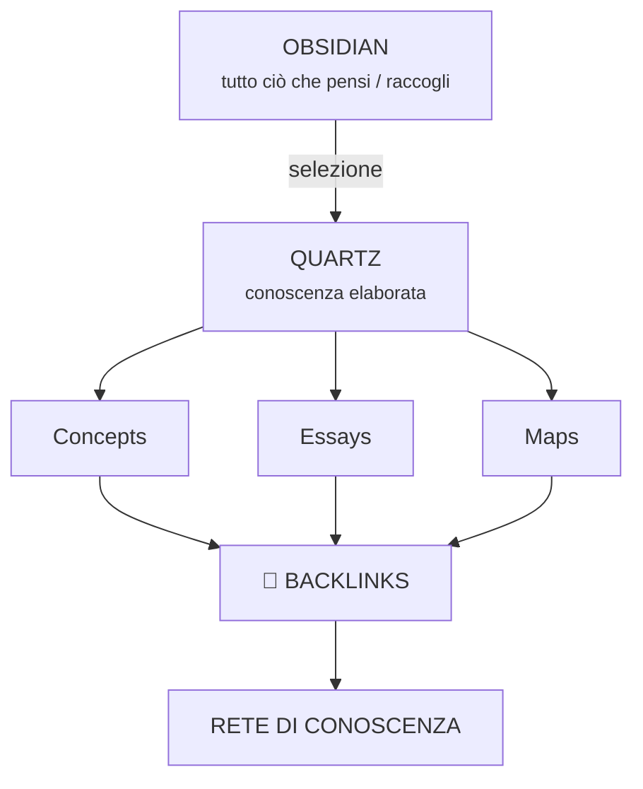

---

# Esempio concreto

Mettiamo che in Obsidian tu abbia:

```
Università/
    matematica/
        proposizioni.md
        insiemi.md
        relazioni.md

Informatica/
    programmazione/
        javascript.md
        architettura-software.md

Idee/
    AI.md
    second-brain.md
    digital-garden.md
```

---

Non devi necessariamente copiare tutta questa struttura.

Nel Garden potresti avere:

```
content/
│
├── index.md
│
├── concepts/
│   ├── proposizioni.md
│   ├── insiemi.md
│   ├── relazioni.md
│   ├── architettura-software.md
│   └── digital-garden.md
│
├── projects/
│   └── token-saver-studio.md
│
├── essays/
│   └── come-costruire-un-second-brain.md
│
└── maps/
    ├── matematica.md
    ├── informatica.md
    └── intelligenza-artificiale.md
```

---

E qui arriva la parte interessante.

Una nota non dovrebbe dire semplicemente:

```
# Insiemi

Gli insiemi sono...
```

Potrebbe diventare:

```
# Insiemi

Un insieme è...

## Collegamenti

- [[Proposizioni]]
- [[Relazioni]]
- [[Logica]]
- [[Matematica discreta]]
```

A quel punto **la struttura del Garden emerge dai collegamenti**, non dalle cartelle.


---


# E le "Maps"?

Questa secondo me è una cosa che ti potrebbe piacere parecchio.

Una mappa non è una categoria.

È una **pagina che organizza un pezzo della tua conoscenza**.

Per esempio:

```
Matematica
│
├── Logica
│   ├── Proposizioni
│   ├── Connettivi logici
│   └── Dimostrazioni
│
├── Insiemi
│   ├── Unione
│   ├── Intersezione
│   └── Relazioni
│
└── Algebra
```

La pagina `matematica.md` potrebbe essere semplicemente una specie di **indice ragionato**.

E i link portano alle note.

Questa è una differenza enorme rispetto a:

```
Matematica/
    Logica/
        ...
```

Nel secondo caso hai una **gerarchia**.

Nel primo hai una **rete**.

Ed è proprio quest'ultima che rende interessante un Digital Garden.

---
# Quindi: niente automatismi?

Per **il tuo caso, inizialmente direi di no**.

Anzi, ti sconsiglio di costruirli subito.

La tua pipeline può essere brutalmente semplice:

```
OBSIDIAN

        ↓

"Questa idea vale davvero?"

        ↓ sì

"C'è qualcosa che posso aggiungere?"

        ↓

"C'è una connessione con qualcos'altro?"

        ↓

COPIA

        ↓

QUARTZ
```

È quasi un processo editoriale.

E questo ti obbliga a fare una cosa molto utile: **selezionare**.

Se importassi automaticamente 2.000 note da Obsidian, avresti semplicemente creato **un altro archivio**.

Se invece nel Garden metti 100 note che rappresentano le cose che hai davvero capito, hai creato una **mappa della tua conoscenza**.


---
## Una regola che userei

Per ogni nota che vuoi portare da Obsidian a Quartz, chiediti:

> **"Se tra tre anni riaprissi questa pagina, troverei qualcosa che vale ancora la pena leggere?"**

Se sì → Garden.

Se no → rimane in Obsidian.

E aggiungerei una seconda domanda ancora più importante:

> **"Questa nota può collegarsi ad almeno un'altra idea?"**

Se la risposta è sì, il Garden comincia a diventare interessante.
